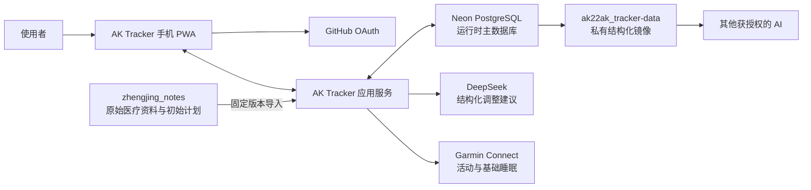
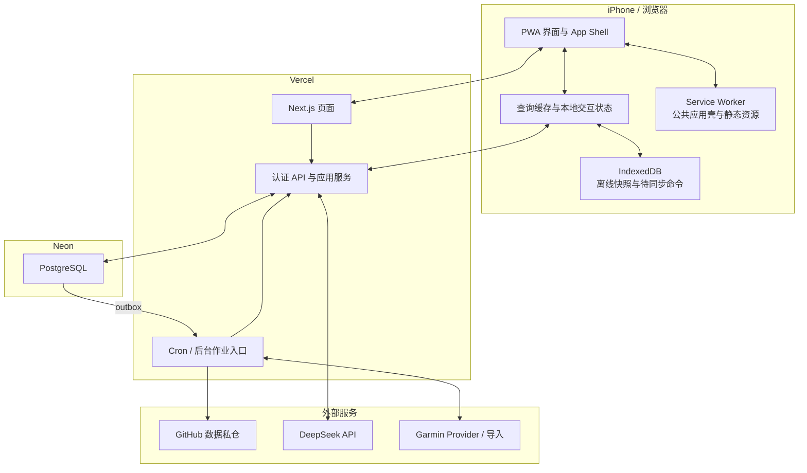
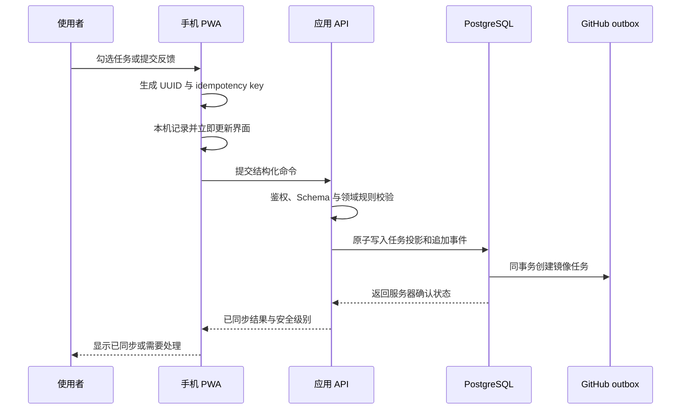

# 系统架构总览

## 文档职责

本文是 AK Tracker 的权威系统蓝图，回答系统由什么组成、各部分怎样协作、数据存放
在哪里，以及用户操作如何变成计划、记录和后续调整。产品范围以
[产品需求](../product-requirements.md)为准，当前实现进度以[项目计划](../project-plan.md)
为准；前端、数据同步、离线和 AI 的实现细节由对应专题架构文档维护。

本文描述已经确认的目标架构。尚未接入或只完成骨架的能力不会因为出现在架构图中
被视为已经交付，实际状态统一记录在项目计划中。

## 系统上下文

AK Tracker 是一个单用户、手机优先的私人追踪系统。膝关节康复是第一个 Tracker，
但计划版本、任务、执行、反馈、外部记录和调整建议属于通用核心。



三个 GitHub 仓库承担不同职责：

| 仓库                  | 职责                                             | 运行时写入方式                        |
| --------------------- | ------------------------------------------------ | ------------------------------------- |
| `ak22ak_tracker`      | 公共应用代码、匿名 Schema、产品与工程文档        | 由开发流程维护，不保存真实健康数据    |
| `ak22ak_tracker-data` | 私有结构化数据镜像、Schema 快照和可读历史        | 应用通过 GitHub Contents API 异步更新 |
| `zhengjing_notes`     | 检查、医嘱、恢复历史和初始康复计划等原始私人笔记 | 应用只读固定来源，不自动改写笔记仓库  |

## 容器与部署架构



- 手机 PWA 负责交互、短期查询缓存、离线队列和同步状态展示。
- Vercel 承载 Next.js 页面、API、身份验证和定时任务入口，不保存持久业务数据。
- Neon PostgreSQL 是运行时权威数据库，承担事务、查询、幂等、版本和同步状态。
- GitHub 数据私仓是 PostgreSQL 的最终一致镜像，不参与页面在线查询。
- DeepSeek 和 Garmin 通过隔离 Adapter 接入，任何一个外部服务都不能阻塞核心闭环。

## 领域与模块边界

| 领域模块       | 负责内容                                          | 主要数据                                                |
| -------------- | ------------------------------------------------- | ------------------------------------------------------- |
| Tracker 核心   | Tracker 生命周期、计划时间线和计划版本            | `trackers`、`plan_versions`                             |
| 每日执行       | 按日期展开任务、完成/跳过和实际训练               | `task_instances`、训练事件                              |
| 身体反馈与安全 | 多次反馈、疼痛/肿胀/功能表现和确定性红黄绿规则    | 反馈事件、安全级别                                      |
| 执行上下文     | 出差、器械受限、零碎时间、暂停和接续              | `execution_contexts`、暂停/恢复事件                     |
| 计划调整       | 汇总上下文、AI Proposal、差异确认、版本应用和回滚 | `ai_analysis_jobs`、`plan_change_proposals`、新计划版本 |
| 外部记录与关联 | Garmin 活动、睡眠、步数及其与任务的人工确认关联   | `external_records`、`external_record_links`             |
| 数据同步与镜像 | 离线重放、外部游标、GitHub outbox 和镜像重建      | `integration_sync_state`、`github_sync_outbox`          |
| 阶段评估       | 目标日期评估、有效训练周和下一阶段决定            | `evaluation_sessions`、决定事件                         |

公共代码只保存通用 Schema、流程和匿名规则接口。膝关节模块保存反馈字段、安全规则以及
Garmin 白名单范围；私人处方、诊断、阈值和医嘱仍属于私人数据域。

## 核心运行流程

### 1. 查看今日计划

1. PWA 先显示本机已有的页面框架和允许缓存的最近数据。
2. 在线时向应用 API 请求指定日期的聚合结果。
3. API 验证 GitHub Session 和账号白名单，从 PostgreSQL 解析该日期有效的计划版本、
   任务、反馈和待处理事项。
4. 返回结果更新查询缓存和白名单 IndexedDB 快照；页面保持任务、来源和更新时间
   可见。

日期选择、Tab、折叠和表单输入先在客户端响应，网络只决定内容何时刷新，不决定
界面是否能够操作。

### 2. 记录训练与身体反馈



- 每项任务只能由使用者确认完成；Garmin 记录和 AI 不能代替勾选。
- 反馈可以在一天内多次追加，突发反馈不会覆盖晨间或训练后记录。
- 红黄绿安全分级先由确定性规则产生，不依赖 AI 是否可用。
- 离线时命令保留在 IndexedDB；恢复联网后使用同一 API 和幂等键按序重放。

### 3. AI 调整计划

```text
已保存的计划、执行和反馈
  -> 确定性安全规则
  -> 使用者明确请求分析并创建 AI 任务
  -> 服务端组织最小化上下文
  -> DeepSeek 返回受限结构化 Proposal
  -> Schema、红黄绿规则、日期和基础版本校验
  -> 使用者查看原因与逐项差异
  -> 接受 / 拒绝 / 稍后处理
  -> 接受后由应用服务创建新的不可变计划版本
  -> 重建受影响的未来任务并创建 GitHub outbox
```

DeepSeek 不持有 PostgreSQL、GitHub 或 Garmin 凭证，也不直接执行数据库操作。建议
绑定基础计划版本；等待确认期间计划已变化时，旧建议过期并重新分析。红灯状态由
确定性规则优先处理，不能被模型降低等级。

### 4. PostgreSQL 更新 GitHub 数据镜像

1. 每次业务写入在数据库事务中同时创建 `github_sync_outbox`。
2. 后台任务读取 outbox，通过 GitHub Contents API 只更新目标 JSON 文件。
3. 成功后记录完成；临时错误自动退避重试，权限错误进入可见失败状态。
4. 页面提交在 PostgreSQL 成功时即完成，镜像延迟不会让反馈或任务退回未保存。
5. 其他获授权的 AI 可以读取私有数据仓库的计划版本、事件、外部记录和快照。

原始笔记仓库不参与每次运行时同步。它提供初始资料和人工维护的原始记录，避免应用
写入与 Mac mini、iCloud 或其他 Agent 的笔记工作流发生冲突。

### 5. Garmin 数据与任务关联

1. 每日 Cron 或“立即同步”使用同一增量窗口调用 Garmin Adapter 或文件导入器。
2. 数据经过白名单、标准化和 Schema 校验后，以 provider record ID 幂等写入
   `external_records`。
3. 系统可以提出“这次活动可能对应某项任务”的关联建议。
4. 使用者确认、修改或取消关联，并自行勾选任务完成状态。

Garmin 同步失败只影响外部记录区域，不影响计划查看、训练记录、反馈和安全规则。

## 数据所有权与存储位置

| 信息                     | 权威来源                    | 副本或派生数据                       |
| ------------------------ | --------------------------- | ------------------------------------ |
| 检查、医嘱、恢复历史     | `zhengjing_notes`           | 不自动复制到公共代码仓库             |
| 初始康复计划文档         | `zhengjing_notes` 固定提交  | 导入为 PostgreSQL 不可变计划版本     |
| 当前计划版本与未来任务   | Neon PostgreSQL             | GitHub 私仓 JSON 镜像、手机只读缓存  |
| 实际训练、反馈和人工决定 | Neon PostgreSQL 追加事件    | GitHub 私仓事件镜像、手机待同步副本  |
| AI 请求、Proposal 和决定 | Neon PostgreSQL             | GitHub 私仓可读镜像                  |
| Garmin 活动与基础睡眠    | Neon PostgreSQL 标准化记录  | GitHub 私仓外部记录镜像              |
| 离线未同步命令           | 手机 IndexedDB              | 服务端确认后删除                     |
| 数据格式                 | 公共代码仓库 Zod Schema     | 私有数据仓库 JSON Schema 快照        |
| OAuth/API/数据库凭证     | Vercel Secrets 或加密数据库 | 不进入浏览器、日志或 GitHub 数据文件 |

PostgreSQL、IndexedDB 和 GitHub 镜像的边界详见[数据与同步](data-and-sync.md)与
[离线流程](offline.md)。

## 代码边界

```text
src/app                 页面、Route Handler 和 HTTP 入口
src/components          客户端交互组件
src/domain              通用 Tracker Schema 与纯领域规则
src/modules             膝关节等 Tracker 模块策略
src/offline             IndexedDB 缓存与待同步队列
src/server/auth         身份和账号白名单
src/server/db           PostgreSQL Schema 与数据访问
src/server/integrations 外部 Provider 契约和 Adapter
src/server/mirror       GitHub 数据镜像
src/server/sync         同步窗口与后台编排规则
schemas                 对外交换 JSON Schema
```

数据库、凭证和外部服务调用只存在于服务端边界。正式数据 API 在 HTTP 入口和数据
访问层分别验证身份、资源归属和输入 Schema，只返回页面需要的聚合 DTO。

## 可靠性与安全边界

- 今日计划、训练记录、身体反馈和确定性安全规则构成核心闭环。
- Garmin、DeepSeek、GitHub 镜像、Web Push 和 Cron 都是可独立失败的集成。
- 数据库写入采用幂等命令；离线重放、Cron 重复触发和 Garmin 重叠窗口不能产生
  重复业务记录。
- 所有计划变更生成不可变版本，保存来源、基础版本、差异、人工决定和应用结果。
- 公共代码、自动化测试和文档不包含真实计划、反馈、Token 或原始医疗内容。
- 自动化测试覆盖领域不变量、数据库事务、离线重放和核心用户旅程；iOS PWA 特有
  行为使用真机验收。

## 专题文档

- [产品需求](../product-requirements.md)：目标、用户旅程、范围与成功标准。
- [项目计划](../project-plan.md)：当前状态、里程碑、风险与下一步。
- [产品与 UI/UX 设计系统](../design/product-and-visual-system.md)：页面与交互规范。
- [客户端数据与导航](client-data-and-navigation.md)：App Shell、查询缓存和即时交互。
- [数据与同步](data-and-sync.md)：实体、事务、同步链路和私有仓库布局。
- [离线流程](offline.md)：本机快照、离线队列、重放与冲突。
- [AI 计划调整](ai-plan-adjustment.md)：Provider、结构化输出和建议生命周期。
- [技术选型](technology-selection.md)：技术栈、职责和替换边界。
- [安全与隐私](../security.md)：身份、Secrets 和私人数据边界。
- [核心场景测试](../testing/core-scenarios.md)：系统不变量、测试分层和发布门禁。
- [部署与运行](../operations/deployment.md)：部署、监控、恢复和回滚 Runbook。
- [Garmin 集成](../operations/garmin.md)：同步范围、Provider 和失效处理。
- [架构决策记录](../adr/README.md)：已经接受的重要决策及其原因。
